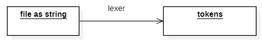

# compiler-with-rust

 Our main objective is to compile a file.lang that contain a simple operation with + - * and / 

 
 example: file.lang 

x = 1;  
y = 5;  
print(x + y);  

 After compiling we expect the result 6 

 <h3>Step 1 : Lexical analysis</h3>
 
According to wikipedia: Lexical analysis is conversion of a text into (semantically or syntactically) meaningful lexical tokens belonging to categorise defined by a "lexer" program 

  

In this project we will create a list of tokens that will be later converted to assembly

<h3>Step 2 : Syntax Analysis (Parsing)  </h3>

Parsing is the next phase after tokenization. It involves taking the stream of tokens from the lexer and analyzing how they fit together according to the grammar rules of the language.

The output of this phase is usually an Abstract Syntax Tree (AST), a hierarchical representation of the structure of the program.

<h3> Step 3 : Error Handling</h3>
 
We will add an error handler to show print error type and a message explaining the error

 
Todo: add diagram of error handing 

